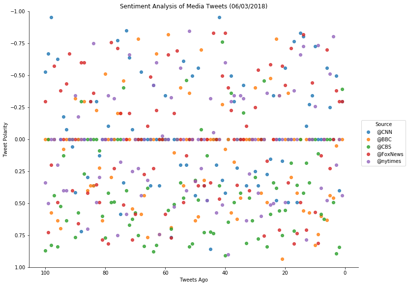
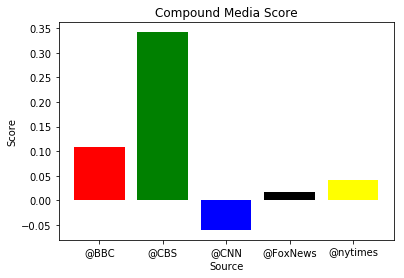

Three observable trends on the data:
    1. Most tweets from news sources are neutral when scored by vader
    2. 4 of the 5 news sources are positive in their compound score, though still relatively close to neutral
        a) CBS is the most positive
        b) CNN is the only negative
    3. Though most tweets are scored neutral, and the compound lean toward neutral, there are significant positive and negative tweets, leading me to believe there is a canceling-out effect happening in the model.


```python
# Dependencies
import tweepy
import pandas as pd
import json
import numpy as np
import matplotlib.pyplot as plt
import seaborn as sns
from datetime import datetime
from twitconfig import (consumer_key, consumer_secret, access_token, access_token_secret)

from vaderSentiment.vaderSentiment import SentimentIntensityAnalyzer
analyzer = SentimentIntensityAnalyzer()

from pprint import pprint
```


```python
# Twitter API Keys
consumer_key = consumer_key
consumer_secret = consumer_secret
access_token = access_token
access_token_secret = access_token_secret
```


```python
# Setup Tweepy API Authentication
auth = tweepy.OAuthHandler(consumer_key, consumer_secret)
auth.set_access_token(access_token, access_token_secret)
api = tweepy.API(auth, parser=tweepy.parsers.JSONParser())
```


```python
# Target Search Term
target_terms = ("@CNN", "@BBC", "@CBS",
                "@FoxNews", "@nytimes")
```


```python
# List to hold results
results_list = []
ctr = 0

# create dataframe to hold all tweets with the columns
all_tweet_df = pd.DataFrame(columns= ['Source', 'Text', 'Date', 'Compound', 'Positive', 
                                      'Neutral', 'Negative', 'Counter'])

# Loop through all target users
for target in target_terms:

    # Variable for holding the oldest tweet
    oldest_tweet = None

    # Variables for holding sentiments
    compound_list = []
    positive_list = []
    negative_list = []
    neutral_list = []
    tweet_number = []
    tweet_text = []
    created_at = []

    # get tweets using the api_timeline to return status objects
    public_tweets = api.user_timeline(screen_name = target, count=100)

    # Loop through all tweets
    for tweet in public_tweets:
        ctr += 1

        # Run Vader Analysis on each tweet
        results = analyzer.polarity_scores(tweet["text"])
        compound = results["compound"]
        pos = results["pos"]
        neu = results["neu"]
        neg = results["neg"]

        # Add each value to the appropriate list
        compound_list.append(compound)
        positive_list.append(pos)
        negative_list.append(neg)
        neutral_list.append(neu)
        tweet_number.append(ctr)
        tweet_text.append(tweet["text"])
        created_at.append(tweet["created_at"])

        # Set the new oldest_tweet value
        oldest_tweet = tweet["id"] - 1
    
    # append Dataframe with above data 
        all_tweet_df = all_tweet_df.append({'Source':target, 'Text':tweet['text'], 'Date':tweet['created_at'], 
                                            'Compound':compound, 'Positive':pos, 'Neutral':neu, 
                                            'Negative':neg, 'Counter':ctr}, ignore_index=True)
        
    # reset ctr for next target/username
    ctr = 0
    
    # Store the Average Sentiments
    sentiment = {
        "Source": target,
        "Compound": np.mean(compound_list),
        "Positive": np.mean(positive_list),
        "Neutral": np.mean(negative_list),
        "Negative": np.mean(neutral_list),
        "Tweet Count": len(compound_list)
    }
    
    # Append airline results to 'results_list'
    results_list.append(sentiment)
```


```python
summary_df = pd.DataFrame(results_list)
summary_df
```


<div>
<style>
    .dataframe thead tr:only-child th {
        text-align: right;
    }

    .dataframe thead th {
        text-align: left;
    }

    .dataframe tbody tr th {
        vertical-align: top;
    }
</style>
<table border="1" class="dataframe">
  <thead>
    <tr style="text-align: right;">
      <th></th>
      <th>Compound</th>
      <th>Negative</th>
      <th>Neutral</th>
      <th>Positive</th>
      <th>Source</th>
      <th>Tweet Count</th>
    </tr>
  </thead>
  <tbody>
    <tr>
      <th>0</th>
      <td>-0.059745</td>
      <td>0.86046</td>
      <td>0.08171</td>
      <td>0.05780</td>
      <td>@CNN</td>
      <td>100</td>
    </tr>
    <tr>
      <th>1</th>
      <td>0.108220</td>
      <td>0.86863</td>
      <td>0.04251</td>
      <td>0.08885</td>
      <td>@BBC</td>
      <td>100</td>
    </tr>
    <tr>
      <th>2</th>
      <td>0.341700</td>
      <td>0.82289</td>
      <td>0.02378</td>
      <td>0.15333</td>
      <td>@CBS</td>
      <td>100</td>
    </tr>
    <tr>
      <th>3</th>
      <td>0.016680</td>
      <td>0.81685</td>
      <td>0.08890</td>
      <td>0.09424</td>
      <td>@FoxNews</td>
      <td>100</td>
    </tr>
    <tr>
      <th>4</th>
      <td>0.040954</td>
      <td>0.86101</td>
      <td>0.05775</td>
      <td>0.08121</td>
      <td>@nytimes</td>
      <td>100</td>
    </tr>
  </tbody>
</table>
</div>


```python
all_tweet_df.head()
```


<div>
<style>
    .dataframe thead tr:only-child th {
        text-align: right;
    }

    .dataframe thead th {
        text-align: left;
    }

    .dataframe tbody tr th {
        vertical-align: top;
    }
</style>
<table border="1" class="dataframe">
  <thead>
    <tr style="text-align: right;">
      <th></th>
      <th>Source</th>
      <th>Text</th>
      <th>Date</th>
      <th>Compound</th>
      <th>Positive</th>
      <th>Neutral</th>
      <th>Negative</th>
      <th>Counter</th>
    </tr>
  </thead>
  <tbody>
    <tr>
      <th>0</th>
      <td>@CNN</td>
      <td>Looking for lower Medicare drug costs? Ask you...</td>
      <td>Sun Jun 03 18:00:10 +0000 2018</td>
      <td>-0.2960</td>
      <td>0.000</td>
      <td>0.864</td>
      <td>0.136</td>
      <td>1</td>
    </tr>
    <tr>
      <th>1</th>
      <td>@CNN</td>
      <td>Former US attorney Preet Bharara says Presiden...</td>
      <td>Sun Jun 03 17:45:09 +0000 2018</td>
      <td>0.4019</td>
      <td>0.153</td>
      <td>0.847</td>
      <td>0.000</td>
      <td>2</td>
    </tr>
    <tr>
      <th>2</th>
      <td>@CNN</td>
      <td>Canadian official Chrystia Freeland calls Pres...</td>
      <td>Sun Jun 03 17:30:15 +0000 2018</td>
      <td>-0.4939</td>
      <td>0.000</td>
      <td>0.758</td>
      <td>0.242</td>
      <td>3</td>
    </tr>
    <tr>
      <th>3</th>
      <td>@CNN</td>
      <td>How one month reshaped the US immigration land...</td>
      <td>Sun Jun 03 17:15:08 +0000 2018</td>
      <td>0.0000</td>
      <td>0.000</td>
      <td>1.000</td>
      <td>0.000</td>
      <td>4</td>
    </tr>
    <tr>
      <th>4</th>
      <td>@CNN</td>
      <td>"The Americans" made motherhood the ultimate d...</td>
      <td>Sun Jun 03 17:00:11 +0000 2018</td>
      <td>-0.2500</td>
      <td>0.000</td>
      <td>0.833</td>
      <td>0.167</td>
      <td>5</td>
    </tr>
  </tbody>
</table>
</div>


```python
# send all_tweet_df to csv as per the instructions
all_tweet_df.to_csv("SentimentDF.csv")
```


```python
df = all_tweet_df.groupby(['Source'])['Compound']
df.head()
```


    0     -0.2960
    1      0.4019
    2     -0.4939
    3      0.0000
    4     -0.2500
    100    0.0000
    101    0.0000
    102    0.0516
    103    0.4574
    104    0.4404
    200   -0.3903
    201    0.8442
    202    0.8932
    203    0.4926
    204    0.0000
    300   -0.2960
    301   -0.2960
    302   -0.3818
    303    0.0000
    304    0.2263
    400    0.4404
    401    0.0000
    402    0.2023
    403   -0.8020
    404   -0.5106
    Name: Compound, dtype: float64


```python
ax = sns.lmplot("Counter", "Compound", data=all_tweet_df, hue='Source', fit_reg=False, size=8,aspect=1.3, legend_out=True)
plt.gca().invert_xaxis()
now = datetime.now()
now = now.strftime("%m/%d/%Y")
plt.title(f"Sentiment Analysis of Media Tweets ({now})")
plt.xlabel("Tweets Ago")
plt.ylabel("Tweet Polarity")
plt.ylim(1,-1)
plt.savefig("SentAnalysisTweets.png")
plt.show()

```





```python
colors = ['blue', 'red', 'green', 'black', 'yellow']
plt.bar(summary_df['Source'], summary_df['Compound'], color=colors)
plt.title("Compound Media Score")
plt.xlabel("Source")
plt.ylabel("Score")
plt.savefig("Compound Media Score.png")
plt.show()
```




